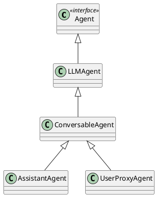
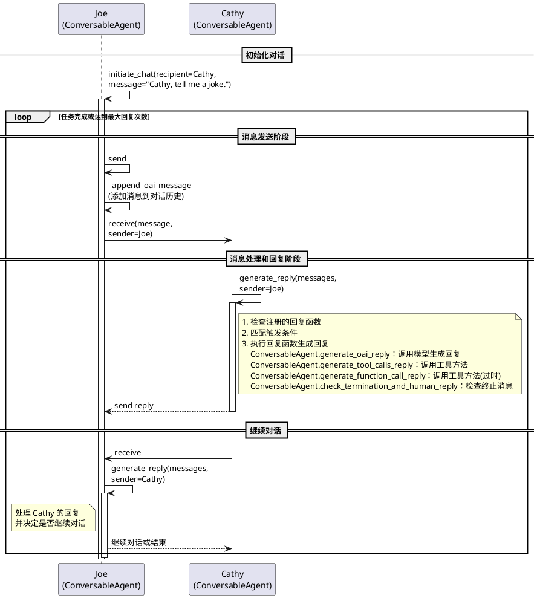

# OpenAI's ChatCompletion Schema

## 问题
你知道OpenAI's ChatCompletion schema吗？

## 回答
是的，OpenAI 的 ChatCompletion schema 是用于与 OpenAI 的语言模型进行交互的一种数据结构，通常用于发送消息和接收模型的响应。该 schema 定义了消息的格式和结构，以便在与模型进行对话时能够正确地传递信息。

### ChatCompletion Schema 的主要组成部分

1. **消息结构**：
   - 每条消息通常包含以下字段：
     - `role`: 消息的角色，通常是 "user"、"assistant" 或 "system"。
     - `content`: 消息的内容，通常是用户输入的文本或模型生成的回复。

2. **请求格式**：
   - 在发送请求时，通常会包含一个消息列表，表示对话的上下文。例如：
     ```json
     {
       "model": "gpt-3.5-turbo",
       "messages": [
         {"role": "system", "content": "You are a helpful assistant."},
         {"role": "user", "content": "What is the capital of France?"}
       ]
     }
     ```

3. **响应格式**：
   - 模型的响应通常会包含生成的消息，格式类似于：
     ```json
     {
       "id": "chatcmpl-abc123",
       "object": "chat.completion",
       "created": 1677649200,
       "model": "gpt-3.5-turbo",
       "choices": [
         {
           "index": 0,
           "message": {
             "role": "assistant",
             "content": "The capital of France is Paris."
           },
           "finish_reason": "stop"
         }
       ]
     }
     ```

### 关注点
在使用 ChatCompletion schema 时，您可以关注以下几点：

- **角色的定义**：理解不同角色（如用户、助手和系统）在对话中的作用，确保消息的角色正确设置。
- **上下文管理**：在发送请求时，合理管理消息的上下文，以便模型能够理解对话的历史。
- **响应处理**：处理模型的响应时，注意检查返回的消息和其他元数据（如 `finish_reason`），以便根据需要进行后续操作。

# autogen/agentchat 目录分析

在 `autogen/agentchat` 目录中，您可以找到以下文件和子目录：

## 文件列表
1. **`__init__.py`** (547 字节)
   - 该文件通常用于将目录标识为一个 Python 包。可以查看其内容以了解包的初始化逻辑。

2. **`agent.py`** (4538 字节)
   - 可能包含与代理相关的主要功能和类。值得关注的内容包括代理的行为和交互逻辑。

3. **`assistant_agent.py`** (5322 字节)
   - 可能实现了具体的助手代理功能。查看此文件可以了解助手如何处理请求和响应。

4. **`chat.py`** (12258 字节)
   - 可能涉及聊天相关的功能，包括消息处理、会话管理等。此文件可能包含多个重要的类和方法。

5. **`contrib`** (包含 44 个子文件)
   - 这个子目录通常包含贡献的代码或扩展功能。可以查看其中的文件以了解额外的功能或工具。

6. **`conversable_agent.py`** (143494 字节)
   - 这是一个较大的文件，可能包含复杂的逻辑和多个类。值得深入分析，以了解可交互代理的实现。

7. **`groupchat.py`** (83538 字节)
   - 可能实现了群聊功能，处理多个用户之间的交互。查看此文件可以了解群聊的管理和消息传递机制。

8. **`user_proxy_agent.py`** (7081 字节)
   - 可能与用户代理相关，处理用户请求和代理之间的交互。

9. **`utils.py`** (7810 字节)
   - 通常包含实用工具函数，可能用于其他模块的辅助功能。

## 关注点
- **核心功能**：重点关注 `agent.py`、`assistant_agent.py` 和 `conversable_agent.py`，这些文件可能包含项目的核心逻辑。
- **聊天和交互**：`chat.py` 和 `groupchat.py` 可能涉及聊天功能的实现，了解这些文件可以帮助您理解用户交互的流程。
- **扩展功能**：查看 `contrib` 目录中的内容，了解是否有额外的功能或工具可以使用。
- **实用工具**：`utils.py` 中的函数可能在多个模块中被调用，了解这些工具函数的实现可以帮助您更好地理解代码的整体结构。

### 类关系图



### 类的作用分析

1. **`Agent`**：作为协议类，定义了所有代理类必须遵循的基本接口。理解这个接口有助于把握其他类的基本要求。
   
   - **属性**：
     - `name`：返回代理的名称。这个名称在与其他代理或用户交互时非常重要。
     - `description`：返回代理的描述，用于在群聊环境中介绍代理的功能和角色。
   
   - **方法**：
     - `send`：发送消息到另一个代理。支持发送字符串或字典格式的消息，并可以选择是否请求回复。
     - `a_send`：异步发送消息到另一个代理，功能与 `send` 类似，但适用于异步编程。
     - `receive`：接收来自其他代理的消息。可以处理字符串或字典格式的消息，并支持请求回复的标志。
     - `a_receive`：异步接收消息，功能与 `receive` 类似。
     - `generate_reply`：基于接收到的消息生成回复。可以处理来自其他代理的消息列表，并返回生成的回复。
     - `a_generate_reply`：异步生成回复，功能与 `generate_reply` 类似。

2. **`LLMAgent`**：继承自 `Agent`，扩展了其功能，可能包括一些特定于大语言模型（LLM）的方法，适用于处理与 LLM 相关的任务。
   
   - **属性**：
     - `system_message`：返回该代理的系统消息，用于定义代理的行为和上下文。
   
   - **方法**：
     - `update_system_message`：更新该代理的系统消息，接受一个字符串参数，用于推理时的上下文设置。

3. **`ConversableAgent`**：继承自 `LLMAgent`，表示可以与用户进行对话的代理。它可能实现了与用户交互的功能。

4. **`AssistantAgent`**：继承自 `ConversableAgent`，实现了特定的助手功能，可能用于提供更复杂的对话和任务处理。

5. **`UserProxyAgent`**：同样继承自 `ConversableAgent`，用于代表用户与其他代理进行交互，可能用于处理用户请求和反馈。

### 了解这些类的重点

- **接口定义**：关注 `Agent` 接口，理解其定义的方法和属性。
- **继承关系**：分析每个类的继承关系，理解它们如何扩展和实现父类的方法。
- **功能实现**：查看每个类实现的具体方法，理解它们的功能和用途。
- **使用场景**：研究这些类在实际应用中的使用场景，特别是如何与用户交互。

### `ConversableAgent` 类

#### 类的作用
[ConversableAgent](cci:2://file:///home/lichangjiang/project/python/autogen/autogen/agentchat/conversable_agent.py:47:0-2969:50) 继承自 `LLMAgent`，是一个通用的可对话代理类，旨在处理与用户的交互。该类的设计目标是能够在接收到消息后，自动生成回复，除非收到的是终止消息。它可以根据需要配置为助手或用户代理，适应不同的应用场景。

#### 关键特性
1. **自动回复机制**：
   - 该类在接收到每条消息后，会自动发送回复，除非消息是终止消息。
   - 可以通过重写 `generate_reply` 方法来修改自动回复的行为。

2. **人机交互模式**：
   - 通过设置 `human_input_mode` 属性，可以控制代理在每次接收到消息时是否请求人类输入。
   - 可选值包括 "ALWAYS"（始终请求输入）、"TERMINATE"（在特定条件下请求输入）和 "NEVER"（从不请求输入）。

3. **代码执行功能**：
   - 该类支持执行代码块，可以通过重写 `execute_code_blocks`、`run_code` 和 `execute_function` 方法来定制代码执行的方式。
   - 通过 `code_execution_config` 属性，可以配置代码执行的相关选项，如工作目录、是否使用 Docker 等。

4. **灵活的配置选项**：
   - 提供多种初始化参数，如 `system_message`、`function_map` 和 `default_auto_reply`，以便在创建代理时进行灵活配置。

#### 重要方法和属性
- **构造函数 `__init__`**：
   - 初始化代理的基本信息，包括名称、系统消息、最大连续自动回复次数等。
   - 处理代码执行配置，确保配置有效并进行相应的初始化。

- **属性**：
   - `name`：返回代理的名称。
   - `description`：返回或设置代理的描述。
   - `code_executor`：返回用于执行代码的执行器，如果代码执行被禁用，则返回 None。

- **方法**：
   - `register_reply`：注册回复处理函数，以便在接收到消息时调用。
   - `_validate_llm_config`：验证 LLM 配置的有效性。

#### 学习重点
在学习 `ConversableAgent` 类时，建议关注以下几个方面：

1. **消息处理逻辑**：
   - 理解该类如何处理接收到的消息，并生成相应的回复，特别是在不同人机交互模式下的表现。

2. **配置选项的灵活性**：
   - 深入研究构造函数中的各个参数，了解如何根据不同需求配置代理。

3. **代码执行功能**：
   - 掌握如何通过该类执行代码块，以及如何配置和使用代码执行器。

4. **继承与扩展**：
   - 理解 `ConversableAgent` 如何继承和扩展 `LLMAgent` 的功能，特别是在消息发送和接收方面的实现。

#### 开始学习的方法
1. **阅读文档**：
   - 查看该类的文档字符串和注释，了解其设计意图和使用场景。

2. **分析实现**：
   - 逐步查看该类的实现，特别是与消息处理和代码执行相关的方法，理解其逻辑。

3. **实验与测试**：
   - 尝试创建 `ConversableAgent` 的实例，并模拟与用户的对话，观察其行为和反应。

### `ConversableAgent` 类的构造函数详细说明

`ConversableAgent` 类的构造函数 `__init__` 负责初始化类的实例，并设置各种属性和配置。以下是构造函数的详细分析：

#### 构造函数参数
1. **name** (str)：代理的名称，用于标识该代理。
2. **system_message** (Optional[Union[str, List]])：系统消息，用于推理时提供上下文，默认为 "You are a helpful AI Assistant."。
3. **is_termination_msg** (Optional[Callable[[Dict], bool]])：一个函数，用于判断接收到的消息是否为终止消息。该函数接收一个字典参数，返回布尔值。
4. **max_consecutive_auto_reply** (Optional[int])：最大连续自动回复次数，默认为 None（没有限制）。
5. **human_input_mode** (Literal["ALWAYS", "NEVER", "TERMINATE"])：控制是否在每次接收到消息时请求人类输入。可选值包括 "ALWAYS"（始终请求）、"TERMINATE"（在特定情况下请求）和 "NEVER"（从不请求）。
6. **function_map** (Optional[Dict[str, Callable]])：将函数名称映射到可调用函数的字典，供工具调用使用。
7. **code_execution_config** (Union[Dict, Literal[False]])：代码执行配置，默认为 False，表示禁用代码执行。
8. **llm_config** (Optional[Union[Dict, Literal[False]]])：LLM 推理配置，默认为 None。
9. **default_auto_reply** (Union[str, Dict])：当没有生成代码执行或 LLM 基于回复时的默认自动回复。
10. **description** (Optional[str])：代理的简短描述，供其他代理使用。
11. **chat_messages** (Optional[Dict[Agent, List[Dict]]])：与其他代理的历史聊天消息，用于提供上下文。
12. **silent** (Optional[bool])：是否打印发送的消息，默认为 None。

#### 构造函数的主要功能
1. **参数处理**：
   - 将 `code_execution_config` 复制以避免修改原始输入。
   - 初始化代理的名称、系统消息、描述、终止消息判断函数等。

2. **聊天消息初始化**：
   - 如果没有提供 `chat_messages`，则使用 `defaultdict(list)` 初始化 `_oai_messages`，用于存储与其他代理的聊天记录。

3. **终止消息函数**：
   - 如果没有提供 `is_termination_msg`，则默认使用一个 lambda 函数来判断消息内容是否为 "TERMINATE"。

4. **LLM 配置验证**：
   - 通过 `self._validate_llm_config(llm_config)` 验证 LLM 配置的有效性。

5. **日志记录**：
   - 如果日志记录功能启用，则调用 `log_new_agent` 记录新代理的创建。

6. **人机交互模式和自动回复设置**：
   - 设置 `human_input_mode` 和最大连续自动回复次数，初始化相关计数器。

7. **函数映射**：
   - 如果提供了 `function_map`，则验证并存储有效的函数映射。

8. **默认自动回复设置**：
   - 初始化 `_default_auto_reply` 和相关的回复函数列表。

9. **回复注册**：
   - 注册多个回复处理函数，包括生成 LLM 回复、工具调用回复等。

10. **代码执行配置**：
    - 根据提供的 `code_execution_config` 设置代码执行功能，确保配置有效，并注册相应的回复处理函数。

11. **钩子列表初始化**：
    - 初始化钩子列表，用于存储可挂钩的方法，以便在接收到消息时调用。

#### 总结
构造函数 `__init__` 为 `ConversableAgent` 类的实例设置了必要的属性和配置，确保代理能够正确处理消息、执行代码、管理人机交互等功能。通过合理的参数设计和默认值，构造函数为代理的灵活性和可扩展性提供了支持。

### `ConversableAgent` 类的 `execute_function` 方法

`execute_function` 方法的作用是执行一个函数调用并返回执行结果。这个方法主要用于处理从 OpenAI 消息中提取的函数调用或工具调用，允许 `ConversableAgent` 类在接收到相关请求时动态执行指定的函数。以下是该方法的详细说明：

#### 方法说明
```python
def execute_function(self, func_call, verbose: bool = False) -> Tuple[bool, Dict[str, str]]:
    """Execute a function call and return the result.

    Override this function to modify the way to execute function and tool calls.

    Args:
        func_call: a dictionary extracted from openai message at "function_call" or "tool_calls" with keys "name" and "arguments".

    Returns:
        A tuple of (is_exec_success, result_dict).
        is_exec_success (boolean): whether the execution is successful.
        result_dict: a dictionary with keys "name", "role", and "content". Value of "role" is "function".
    """
```

#### 参数
- **`func_call`**：一个字典，包含从 OpenAI 消息中提取的函数调用信息，通常包括 `name` 和 `arguments` 两个键。
  - `name`：要执行的函数的名称。
  - `arguments`：传递给函数的参数，通常是一个 JSON 字符串。

- **`verbose`** (bool)：指示是否打印详细的执行信息，默认为 `False`。

#### 返回值
- 返回一个元组 `(is_exec_success, result_dict)`：
  - **`is_exec_success`** (bool)：指示函数执行是否成功。
  - **`result_dict`** (dict)：包含执行结果的信息，包括：
    - `name`：函数名称。
    - `role`：固定为 "function"。
    - `content`：函数执行的输出或错误信息。

#### 方法的实现细节
1. **获取函数名称和函数对象**：
   - 从 `func_call` 中提取 `name`，并通过 `_function_map` 查找对应的函数对象。

2. **参数处理**：
   - 使用 `_format_json_str` 方法格式化 `arguments`，确保其为 JSON 格式字符串。
   - 尝试将格式化后的字符串解析为字典，如果解析失败，则返回错误信息。

3. **执行函数**：
   - 如果找到对应的函数且参数有效，打印正在执行的函数名称，并调用该函数，传入解析后的参数。
   - 捕获执行过程中可能出现的异常，并将错误信息存储在 `content` 中。

4. **详细信息打印**：
   - 如果 `verbose` 为 `True`，则打印输入参数和输出结果，以便于调试和查看执行过程。

5. **返回结果**：
   - 最后返回执行成功与否的标志和结果字典。

#### 总结
`execute_function` 方法为 `ConversableAgent` 提供了动态执行函数调用的能力，能够根据接收到的请求灵活地执行不同的函数，并处理相应的参数和返回结果。这种设计使得代理能够在与用户交互时，调用各种功能和工具，增强了其灵活性和可扩展性。

### `ConversableAgent` 类的 `register_reply` 方法

```python
        self.register_reply([Agent, None], ConversableAgent.generate_oai_reply)
        self.register_reply([Agent, None], ConversableAgent.a_generate_oai_reply, ignore_async_in_sync_chat=True)

        self.register_reply([Agent, None], ConversableAgent.generate_tool_calls_reply)
        self.register_reply([Agent, None], ConversableAgent.a_generate_tool_calls_reply, ignore_async_in_sync_chat=True)
        self.register_reply([Agent, None], ConversableAgent.generate_function_call_reply)
        self.register_reply(
            [Agent, None], ConversableAgent.a_generate_function_call_reply, ignore_async_in_sync_chat=True
        )
        self.register_reply([Agent, None], ConversableAgent.check_termination_and_human_reply)
        self.register_reply(
            [Agent, None], ConversableAgent.a_check_termination_and_human_reply, ignore_async_in_sync_chat=True
        )
```


`register_reply` 方法的作用是注册一个回复函数，该函数将在特定条件下被调用，以便处理来自其他代理的消息。这个方法为 `ConversableAgent` 提供了灵活的消息处理机制，使得代理能够根据不同的触发条件执行相应的回复逻辑。以下是该方法的详细说明：

#### 方法说明
```python
def register_reply(
    self,
    trigger: Union[Type[Agent], str, Agent, Callable[[Agent], bool], List],
    reply_func: Callable,
    position: int = 0,
    config: Optional[Any] = None,
    reset_config: Optional[Callable] = None,
    *,
    ignore_async_in_sync_chat: bool = False,
    remove_other_reply_funcs: bool = False,
):
    """Register a reply function.
    ...
    """
```

#### 参数
1. **`trigger`**：触发条件，可以是以下类型之一：
   - **类**：当发送者是该类的实例时调用回复函数。
   - **字符串**：当发送者的名称匹配该字符串时调用回复函数。
   - **代理实例**：当发送者是该代理实例时调用回复函数。
   - **可调用对象**：当该可调用对象返回 `True` 时调用回复函数。
   - **列表**：当列表中的任一触发条件被激活时调用回复函数。

2. **`reply_func`** (Callable)：回复函数，接收代理实例、消息列表、发送者代理和配置作为输入，并返回回复消息。

3. **`position`** (int)：回复函数在回复函数列表中的位置，默认为 0。后注册的函数将被优先检查。

4. **`config`** (Optional[Any])：传递给回复函数的配置。

5. **`reset_config`** (Optional[Callable])：用于重置配置的函数。

6. **`ignore_async_in_sync_chat`** (bool)：是否在同步聊天中忽略异步回复函数，默认为 `False`。

7. **`remove_other_reply_funcs`** (bool)：是否在注册此回复函数时移除其他回复函数，默认为 `False`。

#### 方法的实现细节
1. **类型检查**：
   - 检查 `trigger` 的类型，确保其为有效类型（类、字符串、代理、可调用对象或列表），否则抛出 `ValueError`。

2. **清除其他回复函数**：
   - 如果 `remove_other_reply_funcs` 为 `True`，则清空当前的回复函数列表。

3. **插入新的回复函数**：
   - 将新的回复函数及其相关信息（包括触发条件、配置等）插入到 `_reply_func_list` 中，位置由 `position` 参数决定。

4. **异步函数处理**：
   - 如果注册的回复函数是异步的，并且 `ignore_async_in_sync_chat` 为 `False`，则在同步聊天中调用该函数时会抛出异常。

#### 总结
`register_reply` 方法为 `ConversableAgent` 提供了灵活的消息处理机制，允许开发者根据不同的触发条件注册多个回复函数。这种设计使得代理能够动态响应来自不同发送者的消息，并根据具体情况执行相应的处理逻辑，增强了代理的灵活性和可扩展性。


```python
cathy = ConversableAgent(
    "cathy",
    system_message="Your name is Cathy and you are a part of a duo of comedians.",
    llm_config={"config_list": [{"model": "gpt-4", "temperature": 0.9, "api_key": os.environ.get("OPENAI_API_KEY")}]},
    human_input_mode="NEVER",  # Never ask for human input.
)

joe = ConversableAgent(
    "joe",
    system_message="Your name is Joe and you are a part of a duo of comedians.",
    llm_config={"config_list": [{"model": "gpt-4", "temperature": 0.7, "api_key": os.environ.get("OPENAI_API_KEY")}]},
    human_input_mode="NEVER",  # Never ask for human input.
)

result = joe.initiate_chat(cathy, message="Cathy, tell me a joke.", max_turns=2)
```
```
joe.initiate_chat -> 
   self.send(msg2send, recipient, request_reply=True, silent=silent) [self is joe] ->
      valid = self._append_oai_message(message, "assistant", recipient, is_sending=True) [self is joe] ->
          self._oai_messages[conversation_id].append(oai_message) [conversation_id is recipient (cathy)]
      recipient.receive(message, self, request_reply, silent) [recipient is cathy] ->  
         reply = self.generate_reply(messages=self.chat_messages[sender], sender=sender) [self is cathy] -> 
                if self._match_trigger(reply_func_tuple["trigger"], sender):
                    final, reply = reply_func(self, messages=messages, sender=sender, config=reply_func_tuple["config"])
                     =================================================================
                     # reply_func include below registered functions:
                     self.register_reply([Agent, None], ConversableAgent.generate_oai_reply)
                     self.register_reply([Agent, None], ConversableAgent.a_generate_oai_reply, ignore_async_in_sync_chat=True)

                     self.register_reply([Agent, None], ConversableAgent.generate_tool_calls_reply)
                     self.register_reply([Agent, None], ConversableAgent.a_generate_tool_calls_reply, ignore_async_in_sync_chat=True)
                     self.register_reply([Agent, None], ConversableAgent.generate_function_call_reply)
                     self.register_reply(
                           [Agent, None], ConversableAgent.a_generate_function_call_reply, ignore_async_in_sync_chat=True
                     )
                     self.register_reply([Agent, None], ConversableAgent.check_termination_and_human_reply)
                     self.register_reply(
                           [Agent, None], ConversableAgent.a_check_termination_and_human_reply, ignore_async_in_sync_chat=True
                     )
                     =================================================================
         if reply is not None:
            self.send(reply, sender, silent=silent) [self is cathy] ->

loop the above process
```

### AI Agent 交互过程分析

以下时序图展示了两个 AI Agent (Joe 和 Cathy) 之间的交互过程：


